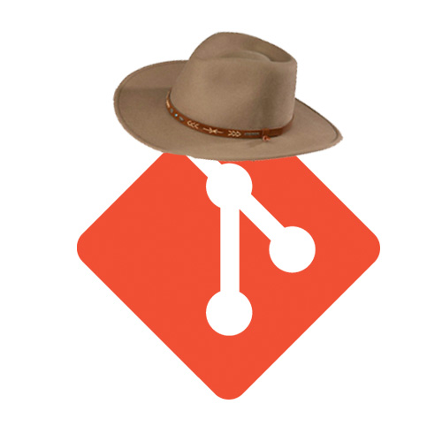

# Git Over Here


A homework helper for GA instructors. Inspired by simon-script.

## Installation!
If this is your first time using _Git Over Here_, [make a personal access token](https://help.github.com/en/articles/creating-a-personal-access-token-for-the-command-line#creating-a-token) with __repo__ permissions, then run `sh setup.sh` to get started. Enter the name of your GitHub enterprise organization (e.g. `sei-nyc-pirates`), and your token.
Git Over Here will only ask for a token if you have not provided one. After you've set it up the first time, you should not need to provide a new one. In addition, run `brew install jq`, to get JQ, a shell JSON parser.

## How to Use!

To use Git Over Here, run `npm run goh` or `./main.sh`.

Then enter the repo(s) you'd like to pull from (e.g. ```js-data-types-homework``` or `candies rails-books-hw birds-express-routes`).

> _Git Over Here_ will automatically clone the branch that students have submitted for their pull requests, and handle any dependencies for Bundle and NPM.

Pulling from the same repository twice will replace the old copy with the new open pulls.

#### Lunch

**Lunch** allows you to run *Git Over Here* with repos pulled from the `lunch.txt` file. A sample is included in `sample.lunch.txt`. It should have a REPOS variable initialized to an array.

To use lunch, you can either add `-l` or `--lunch` to your `./main.sh` call, or run `npm run lunch`.

#### HTTPS vs. SSH

If you prefer to use SSH to fetch your repos, you can either add `-s` or `--ssh` to your `./main.sh` call, or run `npm run gohs`. To run `lunch` with SSH, you can use `npm run lunches`.